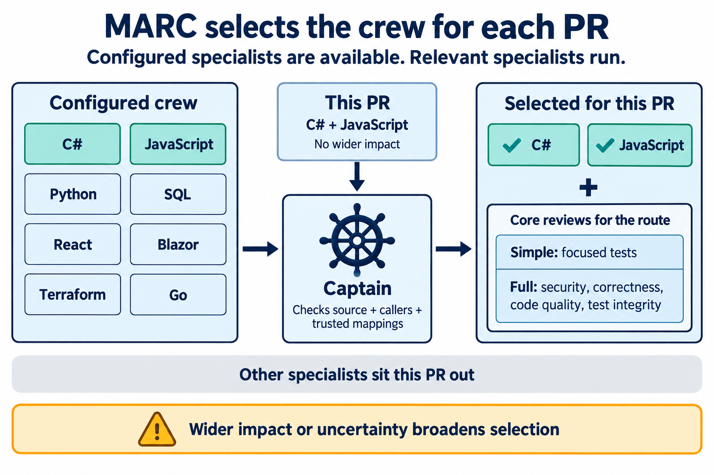

# MARC — Merge Assurance and Review Crew

MARC's Captain coordinates independent PR review, hosted CI evidence, bounded repairs and guarded merges. Each consumer supplies its repository policy, technology guidance and operational configuration.

Start with the [setup prompt](docs/setup-prompt.md), then read the [configuration and command guide](docs/configuration.md). First setup confirms proposed settings. Rerun the same prompt to add missing crew discovery files while preserving existing setup; new activations and available upgrades are proposed for approval.

The [Captain](skills/marc-crew-captain/SKILL.md) leads the simplicity, simple-tests, security, correctness, code-quality, test-integrity and repair skills. Configured [language, framework and front-end specialists](docs/crew.md) supplement the current simple/full routes based on captured source, callers and trusted dependency relationships. Deployment remains separate.


MARC is for repositories that want independent PR assurance, auditable decisions and bounded repairs while retaining their own policy and CI. Specialists run when relevant; missing evidence holds the PR. [Read the workflow and diagram notes](docs/workflow-infographic.md).

## Which crew members run for a PR?

**Configured specialists are available to the Captain; only those relevant to the PR are selected to run.** A large project can configure many members without calling them all into every review.

For example, a PR affecting only C# and JavaScript selects those two specialists, alongside the core reviews required by its route: focused tests for a valid simple route, or security, correctness, code quality and test integrity for a full route. Unrelated specialists sit that PR out.

The Captain checks the complete diff and affected callers against the captured selection and trusted dependency mappings. Selection considers affected behavior, not just changed file extensions: a C# change affecting Blazor can also require Blazor and front-end expertise. Shared configuration changes or uncertain impact broaden selection; missing required expertise holds the review.



See [crew selection rules](docs/crew.md#consumer-selection) and the [infographic notes](docs/crew-selection-infographic.md).

## Install and run

Pin the complete Git bundle in the consumer's `.marc/tool` submodule, and use the same full commit as `toolCommit` in its `.marc/config.json`. Initialize the submodule in local checkouts and CI. Expose the catalogue through the consumer host's skill directories using thin forwarding files; keep the actual skill instructions with the pinned bundle. Discovery does not select a specialist: the trusted configuration pins allowed members and versions. See [installation](docs/installation.md).

The installer defaults to Codex-compatible `.agents/skills`, also supported by Cursor. Select `--hosts codex,claude-code` to add Claude Code's `.claude/skills` wrappers alongside it. All harnesses share the same controller, pin and operational state. See [harness prerequisites and verification limits](skills/marc-crew-captain/references/harnesses.md) before running independent reviews.

```powershell
node .marc/tool/src/quality/marc.cjs --repo . config
```

Configuration resolution is read-only and does not establish authorization to run the workflow. Operational commands require a clean current trusted consumer target branch and the clean pinned tool bundle.

## Crew foundations and external skills

The [basic GitHub Actions member](skills/marc-crew-github-actions/SKILL.md) reviews workflows using MARC's existing review and evidence rules. See [selection and scope](docs/crew.md#github-actions).

External skills used as “mercenary crew members” are deferred. MARC currently supports reviewed members shipped in its pinned catalogue; a skill URL does not enlist a reviewer. Revisit mercenaries after establishing how to inspect their dependencies, contain conflicting instructions and bind approval to reviewed content. No external skill safety guarantee or loading mechanism is provided today.

## Gitleaks and consumer exceptions

Secret scans can find credentials in old commits, even after they have been removed from current files. In GitHub, open the repository's **Security and quality → Secret scanning** alerts. Verify that exposed credentials have been replaced where needed and the old values revoked before excluding their historical occurrences from MARC's separate Gitleaks scan. See [reviewing historical secrets](docs/historical-secrets.md) for the steps and official GitHub guidance.

New consumers start with an [empty ignore file](templates/gitleaksignore); reviewed exclusions stay in the consumer repository. See [Gitleaks configuration and CI](docs/configuration.md#gitleaks-exceptions-and-ci) for setup.

## Development

Use Node.js 24 or later and run `npm test`; no npm install or runtime dependency is needed. Source and adjacent tests are under `src/quality`, published skills under `skills`, and synthetic consumers under `examples`. The optional ASP.NET hook requires .NET 10 and an explicit external artifact root. See [repository layout](docs/repository-layout.md), [contributing](CONTRIBUTING.md) and [improvements](IMPROVEMENTS.md).

Every branch push, including a merge to `master`, runs JavaScript syntax checks and the Node suite on Linux and Windows. PRs also validate the complete skill catalogue, replay deterministic assurance scenarios and show a reminder when instruction inputs change. Fork PRs run the Node checks explicitly because their branch pushes do not reach this repository. See [contribution checks and manual prompt evals](docs/contribution-checks.md).

The implemented CI provider is GitHub Actions. Built-in dependency adapters/classifiers cover .NET/NuGet and npm; other technologies use their own hosted checks and confirmed project guidance. The Python example demonstrates configuration, not a Python scanner. Missing required evidence or expertise is a hold.

Prompt evals remain manual; these workflows do not call models or authorize merges. Scheduled MARC self-review requires its own trusted controller configuration and operating authority. MIT licensed; see [LICENSE](LICENSE).

## Infrastructure specialists

[Bicep](skills/marc-crew-bicep/SKILL.md), [Terraform](skills/marc-crew-terraform/SKILL.md) and [ARM templates](skills/marc-crew-arm-templates/SKILL.md) provide lean IaC review, each at version 1.0.0. See [scope, extensions, CNCF/Azure guidance and activation mappings](docs/iac-review.md). These reviewers consume supplied evidence and do not run infrastructure commands.
