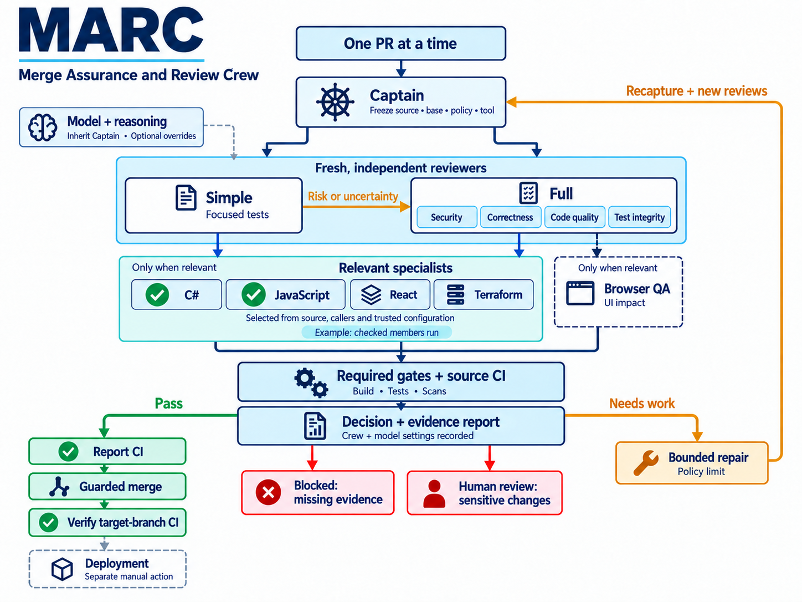

# MARC — Merge Assurance and Review Crew

MARC's Captain coordinates independent PR review, hosted CI evidence, bounded repairs and guarded merges. Each consumer supplies its repository policy, technology guidance and operational configuration.

Start with the [setup prompt](docs/setup-prompt.md), then read the [configuration and command guide](docs/configuration.md). Setup discovers the target repository's values, presents all proposed settings and waits for confirmation and overrides before writing them.

The [Captain](skills/marc-crew-captain/SKILL.md) leads the simplicity, simple-tests, security, correctness, code-quality, test-integrity and repair skills. Configured [language, framework and front-end specialists](docs/crew.md) supplement the current simple/full routes based on captured source, callers and trusted dependency relationships. Deployment remains separate.



MARC is for repositories that want independent PR assurance, auditable decisions and bounded repairs while retaining their own policy and CI. Specialists run when relevant; missing evidence holds the PR. [Read the workflow and diagram notes](docs/workflow-infographic.md).

## Install and run

Pin the complete Git bundle in the consumer's `.marc/tool` submodule, and use the same full commit as `toolCommit` in its `.marc/config.json`. Initialize the submodule in local checkouts and CI. Expose the catalogue through the consumer host's skill directories using thin forwarding files; keep the actual skill instructions with the pinned bundle. Discovery does not select a specialist: the trusted configuration pins allowed members and versions. See [installation](docs/installation.md).

```powershell
node .marc/tool/src/quality/marc.cjs --repo . config
```

Configuration resolution is read-only and does not establish authorization to run the workflow. Operational commands require a clean current trusted consumer target branch and the clean pinned tool bundle.

## Gitleaks and consumer exceptions

A new consumer starts with the [empty Gitleaks ignore template](templates/gitleaksignore). Existing consumers keep their own explicitly reviewed historical fingerprints and reasons. Set `scans.secretExceptions` to their consumer-relative path; the scan wrapper validates it and passes an explicit ignore-file location to Gitleaks. No consumer exceptions ship with MARC. Read [Gitleaks and CI guidance](docs/configuration.md#gitleaks-exceptions-and-ci) before wiring a scan.

## Development

Use Node.js 24 or later and run `npm test`; no npm install or runtime dependency is needed. Source and adjacent tests are under `src/quality`, published skills under `skills`, and synthetic consumers under `examples`. The optional ASP.NET hook requires .NET 10 and an explicit external artifact root. See [repository layout](docs/repository-layout.md), [contributing](CONTRIBUTING.md) and [improvements](IMPROVEMENTS.md).

Every branch push, including a merge to `master`, runs JavaScript syntax checks and the Node suite on Linux and Windows. PRs also validate the complete skill catalogue, replay deterministic assurance scenarios and show a reminder when instruction inputs change. Fork PRs run the Node checks explicitly because their branch pushes do not reach this repository. See [contribution checks and manual prompt evals](docs/contribution-checks.md).

The implemented CI provider is GitHub Actions. Built-in dependency adapters/classifiers cover .NET/NuGet and npm; other technologies use their own hosted checks and confirmed project guidance. The Python example demonstrates configuration, not a Python scanner. Missing required evidence or expertise is a hold.

Prompt evals remain manual; these workflows do not call models or authorize merges. Scheduled MARC self-review requires its own trusted controller configuration and operating authority. MIT licensed; see [LICENSE](LICENSE).
